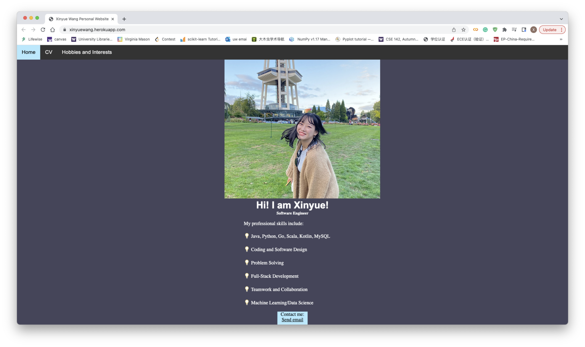
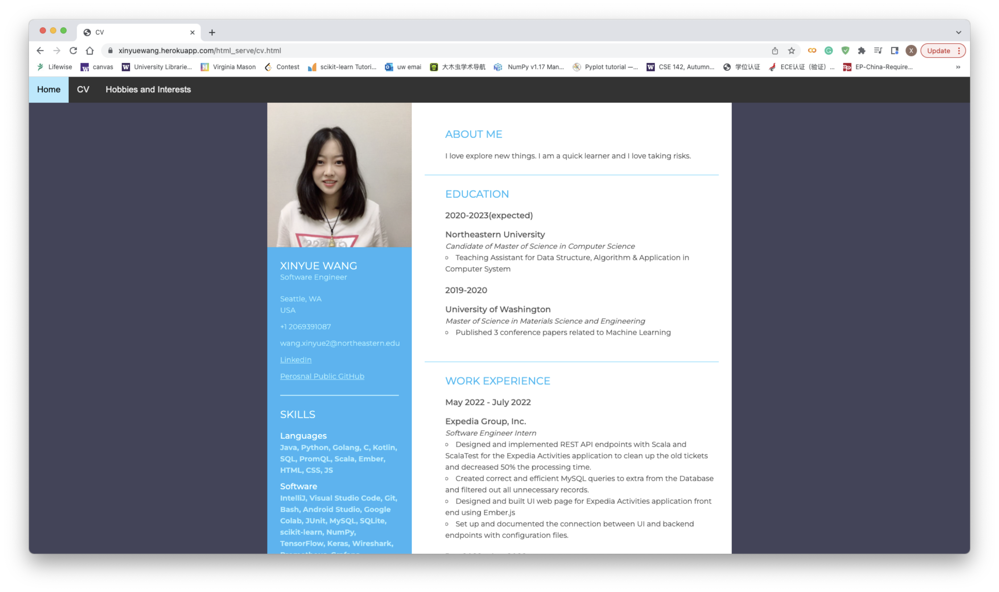
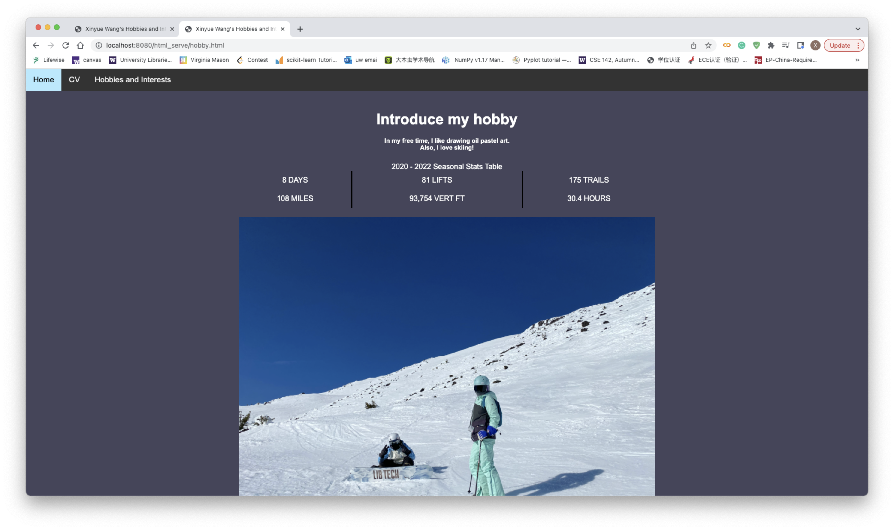

# PersonalWebsite-XinyueWang
Heroku: https://xinyuewang.herokuapp.com/index.html

# Desciption

# How it meet the bullet points listed in assignment
1. A landing page as shown in above
2. Header bar (navigation bar)
3. Two or more internal links refer to the navigation bar
4. One or more external links. In cv page (left) , it have external link to LinkedIn and Perosnal Public GitHub. 
5. At least one HTML table, with CSS styling. In hobby page, I use table to store the stats for skiing.
6. At least one interactive or animated component. The navigation bar, if you put mouse over there, the color change.
7. Attention to responsiveness. I have checked it via my iphone and it works fine. 
